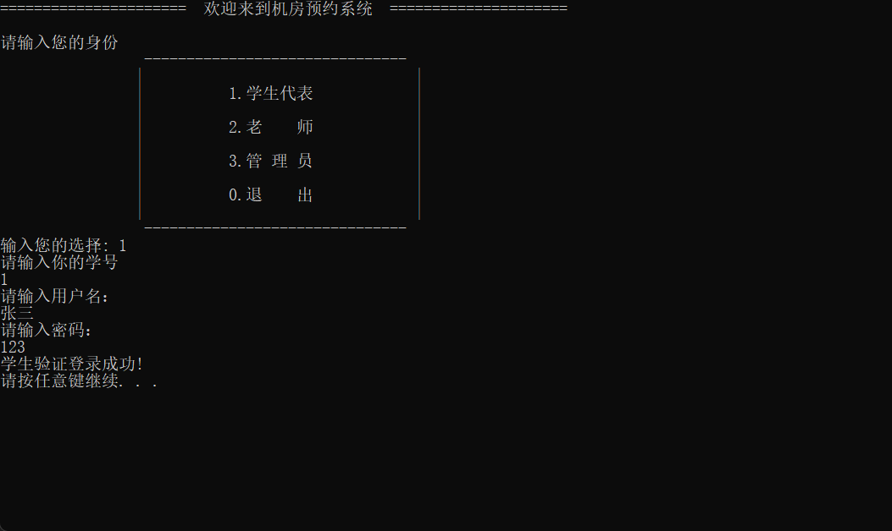
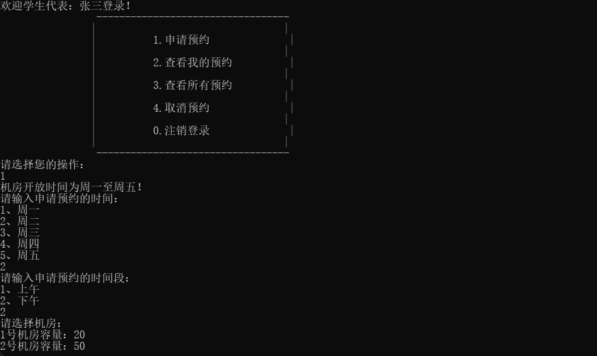
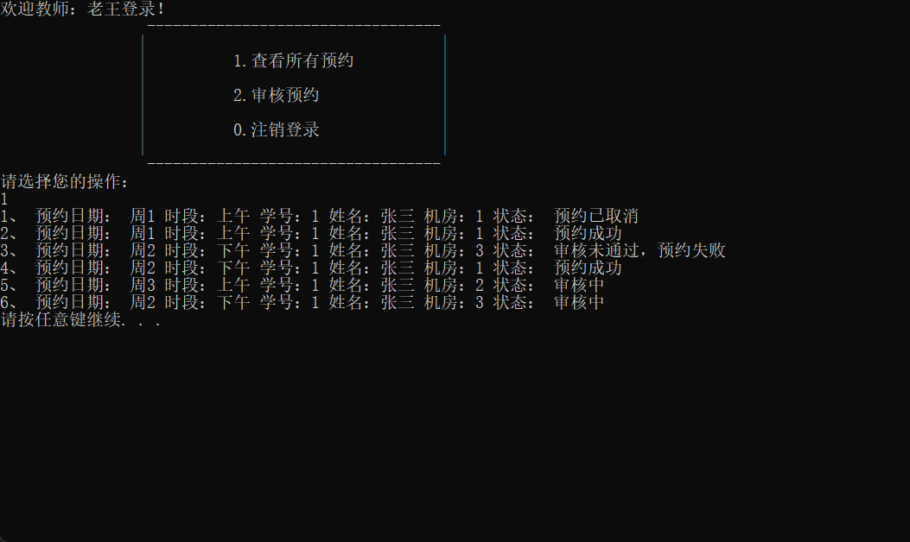
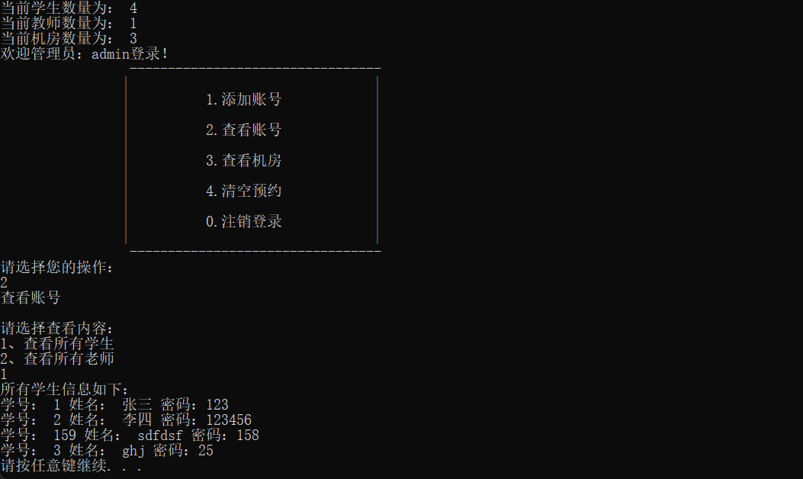

# Reservation-System

## 1. Description
This is a reservation system for a computer lab. It allows users to reserve a computer for a certain time period. It also allows the admin to add and remove computers from the system. The admin can also view all the reservations for a certain computer.

User:

-- **Student:** Applying to use the computer room

-- **Teacher:** Review students' appointment applications

-- **Administrator:** Create accounts for students and teachers

## 2. Show

-----------------

-----------------

-----------------

-----------------

## 3. File Structure
```
Reservation-System
©À©¤ src
©¦  ©À©¤ main.cpp             // main function
©¦  ©À©¤ subMenu.cpp          // sub menu function
©¦  ©À©¤ manager.cpp
©¦  ©À©¤ student.cpp
©¦  ©À©¤ teacher.cpp
©¦  ©¸©¤ orderFile.cpp
©¦
©À©¤include
|   |©¤ subMenu.h
©¦   ©À©¤ manager.h
©¦   ©À©¤ student.h
©¦   ©À©¤ teacher.h
©¦   ©À©¤ globalFile.h
©¦   ©À©¤ computerRoom.h
©¦   ©À©¤ Identity.h
©¦   ©¸©¤ orderFile.h
©¦
©À©¤ README.md
©¸©¤ imgs
```